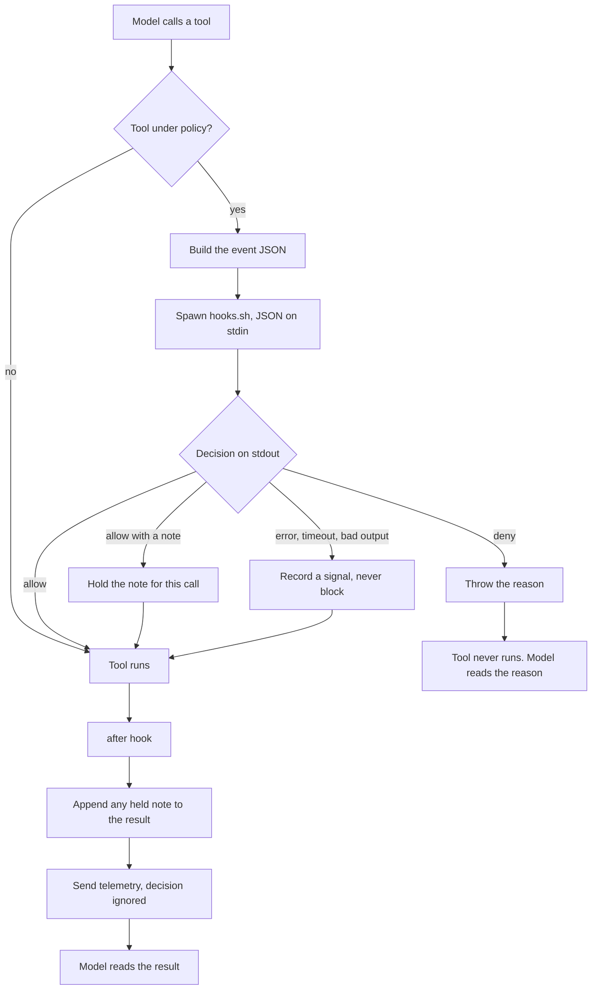

# Armor1 OpenCode plugin

Enforces Armor1 policy inside OpenCode, by handing every tool call to `hooks.sh`, the same
decision engine already used for Claude Code, Cursor, Codex and the rest.

OpenCode has no shell hooks. A plugin is its only extension point, so this is the OpenCode
equivalent of the `hooks_install` entry other clients get.

---

## How it works

Claude Code and OpenCode extend in completely different ways, and that difference explains
every design choice below.

**Claude Code** spawns your hook as a **separate process**: JSON on stdin, decision on
stdout, exit code for allow or block. Claude Code owns that protocol.

**OpenCode** spawns nothing. It **imports this plugin into its own process** at startup and
calls a function when the model uses a tool. There is no stdin, no stdout, no exit code, and
no allow or deny value. **Throwing an exception is the only way to block.**

So the plugin recreates the process protocol itself, inside that function, which is how one
decision engine serves both clients.



Only the deny branch throws. Every failure on the plugin's side lands in the same place as
an allow.

### Who decides what

| Decided by | What |
|---|---|
| OpenCode | which hook functions exist, that throwing aborts a call, that the after hook's output is what the model reads, and that there is no timeout |
| This plugin | the event JSON, the flags passed to `hooks.sh`, how its answer is read, and what happens on error |

---

## What it covers

Fifteen of the eighteen sections other clients install.

| Section | Type | Fires on |
|---|---|---|
| `command_execution` | enforcement | `bash` |
| `file_access_read` | enforcement | `read` |
| `file_access_write` | enforcement | `write`, `edit`, `apply_patch` |
| `network_access` | enforcement | `webfetch`, `websearch` |
| `mcp` | enforcement | any MCP tool |
| `post_shell_execution` | telemetry | `bash`, after it runs |
| `post_write_file` | telemetry | write tools, after they run |
| `post_network_access` | telemetry | web tools, after they run |
| `post_mcp` | telemetry | MCP tools, after they run |
| `before_submit_prompt` | telemetry | every prompt |
| `session_start` | telemetry | first prompt of a session |
| `stop` | telemetry | end of each turn |
| `stop_failure` | telemetry | a provider error |
| `model_token_usage` | telemetry | end of each turn |
| `model_token_usage_subagent` | telemetry | end of a subagent's turn |

Enforcement sections can block a call. Telemetry sections only report.

Not built: `subagent_start`, `subagent_stop`, and `session_end`, which has no OpenCode
equivalent at all.

---

## Design rules

These are the non-obvious ones. Each exists because of something OpenCode does.

**One throw site.** A crash looks exactly like a policy denial to OpenCode, so a bug that
throws would silently deny the user's work. Every hook body is wrapped; only an explicit
deny throws. `test/index.test.ts` drives every hook with malformed input and asserts none of
them reject.

**Failures never block.** A missing hook script, a timeout, unreadable output, or a bug all
resolve to allow. Missing enforcement is meant to be caught centrally by absent telemetry,
not by blocking someone's work.

**Own the timeout.** OpenCode waits forever for a plugin hook. The plugin enforces 10
seconds itself, matching what other clients declare, and treats expiry as allow.

**Never block the event loop.** The plugin runs inside OpenCode's process, so the hook is
spawned asynchronously. A synchronous spawn would stall every other session.

**A denial must explain itself.** The `reason` from the matching policy rule is what gets
thrown, and it reaches the model verbatim as the tool result. An allow can carry a note too,
appended to the tool result, since the after hook's output is the object OpenCode hands back.

**Resolve `current` both ways.** The agent's pointer to the active build is a symlink on
unix and a text file holding the build id on Windows, and on any filesystem without symlink
support. Treating it as a directory works on a Mac and finds nothing on Windows, which looks
identical to having no policy assigned.

**Read arguments defensively.** File paths accept `filePath`, `file_path`, `path` or `file`,
patches accept `patchText`, `patch` or `diff`. File-write enforcement hangs on these keys, so
a rename in a future OpenCode release must not silently stop matching.

---

## Layout

Five source files, each with section banners inside.

- **`index.ts`** is what OpenCode calls. It holds the five hook functions, all session state,
  the token ledger and the signal recorder. The only file with state, and the only `throw`.
- **`event.ts`** decides which policy section a tool call belongs to, then builds the event
  JSON for it.
- **`hook.ts`** reads `policies.json`, spawns `hooks.sh`, and parses its answer.
- **`normalize.ts`** turns untrusted input into known shapes: raw JSON, MCP tool ids, patch
  bodies, file paths.
- **`types.ts`** is the shared vocabulary, imported by everything.

Everything outside `index.ts`, and outside the spawning half of `hook.ts`, is a pure
function, which is why the unit tests never launch OpenCode.

---

## Tests

Two tiers, both in `test/`.

**Unit tests** mirror the modules and need nothing installed. 73 of them.

```
test/normalize.test.ts   MCP id resolution, patch parsing
test/hook.test.ts        reading policies.json, parsing a decision
test/event.test.ts       routing, payload shaping
test/index.test.ts       token ledger, and that no hook ever throws
```

**End-to-end tests** run the real `opencode` binary. 59 assertions across 9 scenarios. A fake
model replays scripted tool calls, a stub stands in for `hooks.sh`, and everything is
isolated into a temp directory so your own config is never touched.

| Scenario | Proves |
|---|---|
| `enforce` | allow and deny for shell, file read, file write and network, plus the reason reaching the model |
| `patch` | file writes are still enforced on GPT-class models, where `apply_patch` replaces `write` and `edit` |
| `mcp_tools` | real MCP traffic against a stub server, including recovering a server name from a flattened tool id |
| `tokens` | token counts flushed per turn |
| `anthropic` | cache-creation tokens, which only exist in Anthropic's wire format |
| `subagent` | subagent usage attributed separately from its parent |
| `failure` | a provider error becomes `stop_failure` |
| `degraded_missing`, `degraded_hang` | a missing hook script and a hanging one both fail open |

---

## Commands

```
npm run typecheck     # tsc, strict
npm test              # unit tests, no dependencies
npm run build         # bundle to dist/armor1-opencode.js + .sha256
./test/e2e/run.sh     # build first. Add a scenario name to run just one
```

The end-to-end suite needs the `opencode` binary on PATH and `jq`.

TypeScript ships as source: OpenCode transpiles it with its bundled Bun runtime. The build
still bundles to one file so the installer has a single asset with a stable digest.

---

## Known gaps

- `opencode --pure` disables all plugins, and a plugin that fails to load is skipped
  silently. Enforcement cannot resist someone who wants it off.
- A subagent runs as its own session, so `session_start`, `before_submit_prompt` and `stop`
  fire for it as well as the parent. Claude Code reports one of each.
- `stop` fires twice for a turn that errors, and a turn that dies before producing a response
  still reports `completed`. Left alone because nothing reads these yet.
- Shell commands the user types directly, rather than the model calling a tool, bypass the
  plugin entirely.
- Desktop app support is unverified.
