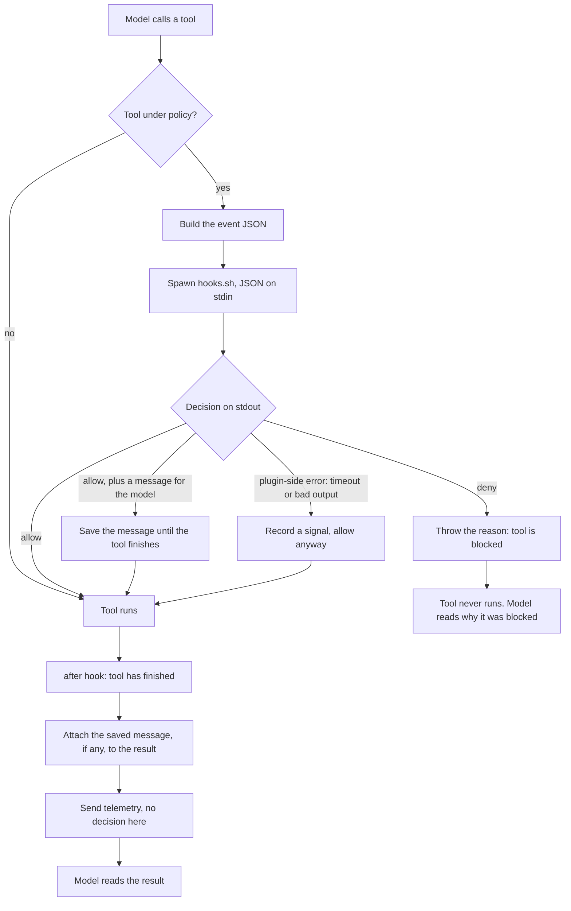

# Armor1 OpenCode plugin

Enforces Armor1 policy inside OpenCode, by handing every tool call to `hooks.sh`, the same
decision engine already used for Claude Code, Cursor, Codex and the rest.

OpenCode has no shell hooks. A plugin is its only extension point, so this is the OpenCode
equivalent of the `hooks_install` entry other clients get.

---

## How it works

Claude Code and OpenCode extend in completely different ways, and that difference explains
every design choice below.

**Claude Code** spawns the hook as a **separate process**: JSON on stdin, decision on
stdout, exit code for allow or block. Claude Code owns that protocol.

**OpenCode** spawns nothing. It **imports this plugin into its own process** at startup and
calls a function when the model uses a tool. There is no stdin, no stdout, no exit code, and
no allow or deny value. **Throwing an exception is the only way to block.**

So the plugin recreates the process protocol itself, inside that function, which is how one
decision engine serves both clients.



Only the deny branch throws. Every failure on the plugin's side lands in the same place as
an allow.

---

## One bundle, two OpenCode lines

OpenCode ships as two separate packages with different plugin APIs: `opencode-ai` (the 1.x
"V1" line) and `@opencode/cli` (the 2.x "V2" line). This plugin serves both from one file.
`index.ts` default-exports `{ id, setup, server }`; **V1 calls `server()`, V2 reads `setup`,
and each runtime ignores the other half.**

The two differ only at the edges, so most of the code is shared:

| | V1 | V2 |
|---|---|---|
| registration | `server()` returning a hooks object | `setup()` registering `ctx.*.hook` |
| command tool | `bash` | `shell`, plus `execute` (code mode) |
| write tool | `apply_patch` | `patch` |
| MCP call | a tool id reaching the hook | only inside `execute` code, read from the program text |
| token usage | running total per message, delta computed here | per-step deltas off the event bus |

Everything version-agnostic (event shaping, the `hooks.sh` bridge, payload builders) is
shared verbatim; only registration and the tool-routing table differ.

---

## What it covers

Fifteen of the eighteen sections other clients install.

| Section | Type | Fires on (V1 / V2) |
|---|---|---|
| `command_execution` | enforcement | `bash` / `shell`, `execute` |
| `file_access_read` | enforcement | `read` |
| `file_access_write` | enforcement | `write`, `edit`, `apply_patch` / `patch` |
| `network_access` | enforcement | `webfetch`, `websearch` |
| `mcp` | enforcement | an MCP tool id / an MCP call parsed from `execute` code |
| `post_shell_execution` | telemetry | command tools, after they run |
| `post_write_file` | telemetry | write tools, after they run |
| `post_network_access` | telemetry | web tools, after they run |
| `post_mcp` | telemetry | MCP tools, after they run |
| `before_submit_prompt` | telemetry | every prompt |
| `session_start` | telemetry | first prompt of a session |
| `stop` | telemetry | end of each turn |
| `stop_failure` | telemetry | a provider error |
| `model_token_usage` | telemetry | end of each turn |
| `model_token_usage_subagent` | telemetry | end of a subagent's turn |

Enforcement sections can block a call. Telemetry sections only report.

Not built: `subagent_start`, `subagent_stop`, and `session_end`, which has no OpenCode
equivalent.

### MCP on V2 goes through code mode, and still reaches the hooks

V2 exposes MCP tools only inside the `execute` tool, as model-written TypeScript like
`await tools["notion-server"]["API-get-self"]()`. Each MCP call the program makes runs through
the same `execute.before` / `execute.after` hooks as a direct call, named `server_tool` and
sharing the parent call's id (`packages/core/src/tool.ts`), so it is gated as `mcp` and
reported as `post_mcp` with its real arguments and result. A deny fails that one call inside
the program. The `execute` wrapper itself passes through `command_execution` with the code as
the command. The plugin does not parse program text.

---

## Design rules

These are the non-obvious rules. Each follows from a specific OpenCode behavior.

**One throw site.** A crash looks exactly like a policy denial, so a bug that throws would
silently deny the user's work. Every hook body is wrapped; only an explicit deny throws. True
on both lines: a throw in either the before or after hook aborts the call.

**Failures never block.** A missing hook script, a timeout, unreadable output, or a bug all
resolve to allow. Missing enforcement is caught centrally by absent telemetry, not by
blocking the user's work.

**Own the timeout.** OpenCode waits forever for a plugin hook. The plugin enforces 30 seconds
itself, matching what other clients declare, and treats expiry as allow.

**Never block the event loop.** The plugin runs inside OpenCode's process, so the hook is
spawned asynchronously and detached; a synchronous spawn would stall every other session.

**A denial must explain itself.** The `reason` from the matching rule is what gets thrown, and
it reaches the model verbatim as the tool result. An allow can carry a note too, appended to
the result (a string `output` on V1, a `content` parts array on V2).

**One instance per project.** In V2 service mode the bundle loads once per open project and
every instance hears every bus event, but a session's hooks reach only its own instance. Token
and stop reporting is gated to sessions this instance actually saw, or two open projects double
every count.

**Resolve `current` both ways.** The pointer to the active build is a symlink on unix and a
text file holding the build id on Windows. Treating it as a directory finds nothing on Windows,
which looks identical to no policy assigned.

**Read arguments defensively.** File paths accept `filePath`, `file_path`, `path` or `file`;
patches accept `patchText`, `patch` or `diff`; commands accept `command`, `cmd` or `code`. A
rename in a future OpenCode release must not silently stop matching.

---

## Layout

Eight source files:

- **`index.ts`** the dual export OpenCode loads: `server` for V1, `setup` for V2.
- **`v1.ts`** / **`v2.ts`** the per-line adapters: registration and the tool-routing table.
- **`runtime.ts`** the version-agnostic core, shared by both: config load, the `hooks.sh`
  bridge, decision handling, and both token accumulators.
- **`event.ts`** routes a tool call to a policy section and builds the event JSON.
- **`normalize.ts`** turns untrusted input into known shapes: raw JSON, MCP tool ids, patch
  bodies, file paths.
- **`hook.ts`** reads `policies.json`, spawns `hooks.sh`, and parses its answer.
- **`types.ts`** the shared vocabulary, imported by everything.

Everything outside the adapters and the spawning half of `hook.ts` is a pure function, which
is why the unit tests never launch OpenCode.

---

## Tests

Two tiers, both in `test/`.

**Unit tests** mirror the modules and need nothing installed. 118 of them.

```
test/normalize.test.ts   MCP id resolution, patch parsing
test/hook.test.ts        reading policies.json, parsing a decision
test/event.test.ts       routing, payload shaping
test/v1.test.ts          V1 adapter, token ledger, and that no hook ever throws
test/v2.test.ts          V2 adapter: code-mode routing, MCP via tool hooks, per-session dedup
```

**End-to-end tests** run the real `opencode` binary. 81 assertions across 11 scenarios. A fake
model replays scripted tool calls, a stub stands in for `hooks.sh`, and everything is isolated
into a temp directory, so the developer's own config is never touched. The `v2_*` scenarios cover the V2
line; the rest cover V1.

| Scenario | Proves |
|---|---|
| `enforce`, `v2_enforce` | allow and deny for command, read, write and network, plus the reason reaching the model |
| `patch` | writes stay enforced on GPT-class models, where `apply_patch` / `patch` replaces `write` and `edit` |
| `mcp_tools`, `v2_codemode` | MCP traffic against a stub, and the V2 code-mode wrapper reported as a command |
| `tokens`, `v2_tokens` | token counts flushed per turn |
| `anthropic` | cache-creation tokens, which only exist in Anthropic's wire format |
| `subagent` | subagent usage attributed separately from its parent |
| `failure`, `v2_failure` | a provider error becomes `stop_failure` |
| `degraded_missing`, `degraded_hang` | a missing hook script and a hanging one both fail open |

---

## Commands

```
npm run typecheck     # tsc, strict
npm test              # unit tests, no dependencies
npm run build         # bundle to dist/armor1-opencode.js + .sha256
./test/e2e/run.sh     # build first. Add a scenario name to run just one
```

The end-to-end suite needs the `opencode` binary on PATH and `jq`.

The bundle in `dist/` is the shipped artifact: one file with a stable digest, published as a
release asset. OpenCode transpiles the source with its bundled runtime, so no build step runs
on the customer machine.

---